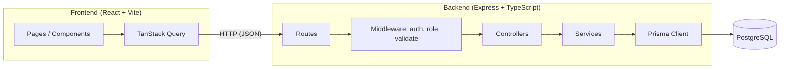

# Architecture – Puls

## Overview



## Backend request flow

1. **Route** – maps an HTTP method + path to a controller.
2. **Middleware** – `authenticate` (verifies JWT), `authorize(role)` (checks
   role), `validate(schema)` (checks request body with Zod).
3. **Controller** – reads the request, calls a service, sends the response.
   No business logic here.
4. **Service** – contains the business logic (e.g. conflict checking) and
   calls Prisma directly. No separate repository layer — Prisma is the data
   access layer.
5. **Prisma Client** – talks to PostgreSQL.

Example for `POST /api/appointments`:

```
routes/appointments.ts
  → authenticate
  → authorize(['DOCTOR', 'ADMIN'])
  → validate(createAppointmentSchema)
  → appointmentController.create
      → appointmentService.create
          → checks for time conflicts
          → prisma.appointment.create(...)
```

## Folder structure

```
/frontend
  src/
    components/     Reusable, domain-agnostic UI (Button, Card, Modal...)
    features/        One folder per domain (auth, appointments, calendar,
                     patients, documentation, dashboard)
    layouts/         AppLayout, AuthLayout
    pages/           Route-level components
    hooks/           Shared hooks (e.g. useAuth)
    services/        API client functions (fetch wrappers)
    schemas/         Zod schemas (shared with form validation)
    types/           Shared TypeScript types
    utils/           Date formatting, etc.

/backend
  src/
    routes/          Express routers, one file per resource
    controllers/      Request/response handling
    services/         Business logic
    middleware/        authenticate, authorize, validate, errorHandler
    validators/        Zod schemas for request bodies
    types/              Shared TypeScript types
    utils/              Helpers (e.g. date/time conflict check)
    prisma/             schema.prisma, migrations, seed.ts
```

## Cross-cutting decisions

- **Time zones:** all timestamps stored in UTC in PostgreSQL. The frontend
  converts to `Europe/Stockholm` for display using a small date utility.
- **Errors:** every error response has the shape
  `{ "error": { "code": "STRING_CODE", "message": "human readable" } }`.
  Known error codes are listed in `docs/api.md`.
- **Auth:** JWT sent as `Authorization: Bearer <token>`. Token storage
  location (localStorage vs httpOnly cookie) is decided in week 5 and
  documented there.
- **No delete of appointments:** cancelling sets `status = CANCELLED`
  instead of removing the row.
