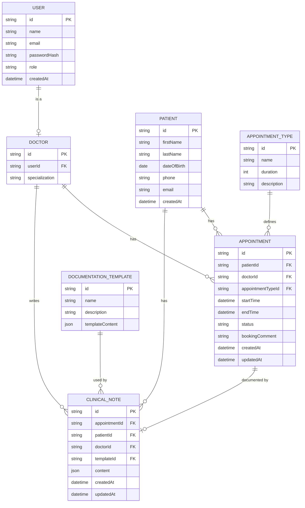

# ER diagram – Puls

## Notes

- `USER ||--o| DOCTOR`: one-to-one, optional. Only users with role Doctor have
  a Doctor row. Admin users have no Doctor row.
- `APPOINTMENT ||--o| CLINICAL_NOTE`: one-to-one, optional. One note per
  appointment in the MVP (`appointmentId` is unique on `CLINICAL_NOTE`).
- `CLINICAL_NOTE.content` and `DOCUMENTATION_TEMPLATE.templateContent` are
  stored as JSON rather than separate tables, to keep templates simple.
- `APPOINTMENT.status` is an enum: SCHEDULED, CONFIRMED, COMPLETED, CANCELLED,
  NO_SHOW.
- Cancelling an appointment is a status change, not a delete — history is
  always kept.
