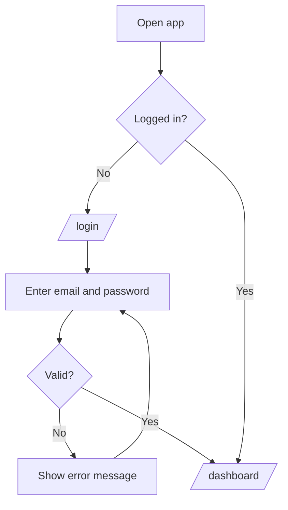
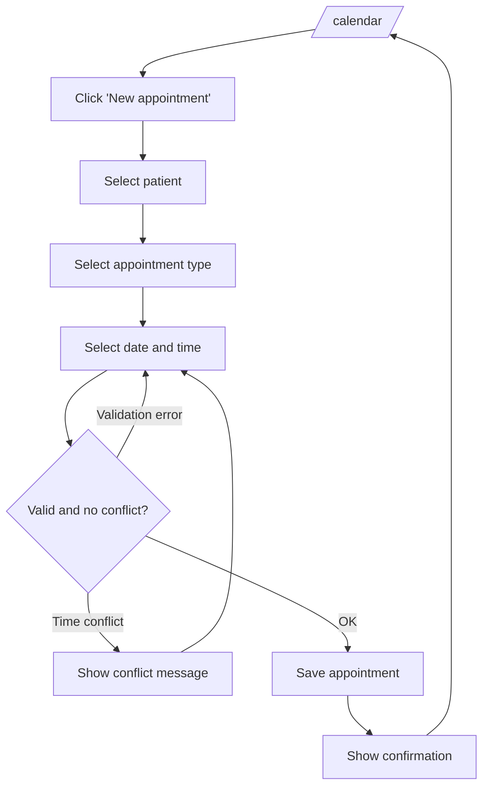
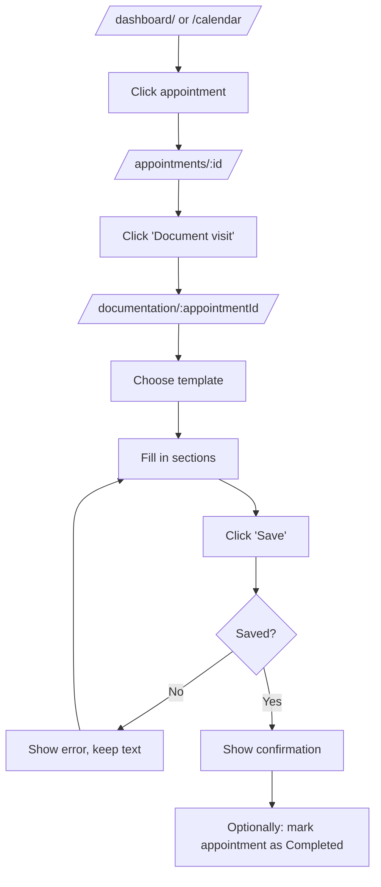
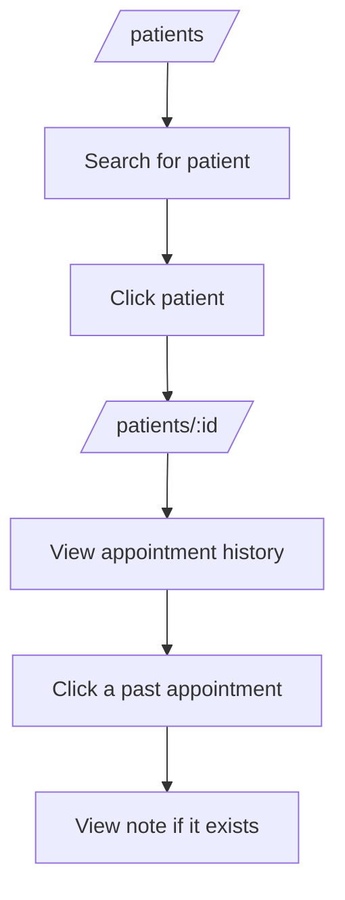
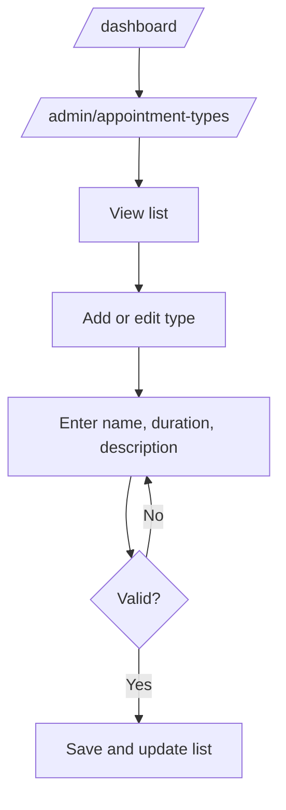

# User flows – Puls

## Flow 1: Login

## Flow 2: Doctor creates an appointment

## Flow 3: Doctor documents a visit

## Flow 4: Doctor looks up patient history

## Flow 5: Admin manages appointment types

